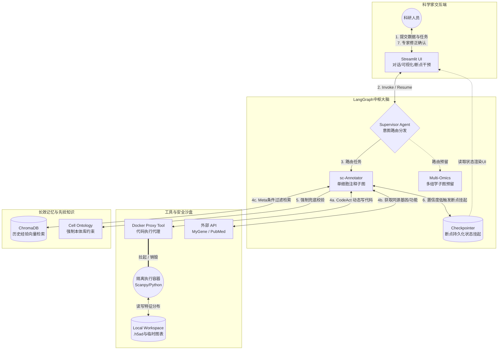

# 🧬 sc-Annotation Agent 架构演进与开发备忘录 (Architecture Memo)

**文档说明**：本文档汇总了从“线性自动化单细胞注释脚本”向“通用型多组学分析智能体（General-Purpose Omics AI Agent）”演进全过程中的核心设计决策、技术选型方案以及避坑指南。本架构深度融合了顶级学术成果《Biomni》（大模型+容器化沙盒）、《BioAgents》（轻量化SLM+元认知）的设计哲学，并继承了早期 R 版本脚本中卓越的本体库约束与容错工程经验。

---

## 第一部分：系统演进路线图 (The Evolution Journey)

我们的架构经历了 6 次极其关键的思想升维，最终确定了目前的终极形态：

### 阶段 1：从“单次对话”到“循环与人机协同 (Human-in-the-loop)”
* **痛点**：传统脚本容易产生生物学幻觉，人类无法干预。
* **决策**：引入 **Streamlit UI** 和 **LangGraph 状态机**。放弃黑盒全自动，在低置信度时触发断点（Breakpoint），在前端向科学家展示图表（如 VlnPlot），获取人类反馈后唤醒 Agent 继续执行。
* **UI 选型**：全面采用 **Streamlit**（完美契合数据科学，抛弃繁重的前后端分离）。

### 阶段 2：全面拥抱 Python 生态 (Scanpy 替代 R)
* **痛点**：在 Python Agent 流程中穿插调用 R（Seurat）进行可视化，环境极易崩溃。
* **决策**：在最前端通过隔离容器实现 `.rds` 到 `.h5ad` 的转换。后续 Agent 探索全部基于纯 Python 的 **Scanpy** 生态，并支持 `.h5mu` (MuData)。

### 阶段 3：借鉴 Biomni 引入 CodeAct (代码即动作)
* **痛点**：为每一个生信功能写具体的 Tool 极大限制了 Agent 的探索能力。
* **决策**：引入 **Code-as-Action (代码驱动)**。Agent 遇到复杂问题可动态编写 Python 代码操作原始数据，变身“实战科学家”。

### 阶段 4：引入 Multi-Agent 模块化 (Supervisor-Worker)
* **痛点**：混合流程导致逻辑混乱、Prompt 爆炸。
* **决策**：采用 **图嵌套（Nested Graphs）** 和 **Supervisor 路由分发**。主管负责意图识别（Semantic Routing），打工人子图（如 sc-Annotator）负责专职干活。

### 阶段 5：终极执行形态 —— 容器化安全沙盒 (Containerization)
* **痛点**：大模型自由写代码非常危险，且模块间依赖冲突严重。
* **决策**：采用 **代理模式 Tool + Docker 容器化**。大模型生成的代码在隔离的、用完即焚的专属 Docker 镜像中运行，通过挂载（Volume）实现安全数据交换。

### 阶段 6：轻量化与隐私保护 (拥抱 SLM 小语言模型) 🌟
* **痛点**：医疗组学数据具备高度机密性，无法通过 API 传给云端模型。
* **决策**：参考《BioAgents》逻辑，架构底层接口解耦，**原生支持接入本地部署的 SLMs**（如 Llama-3, Qwen, Phi-3）。确保在断网环境下系统依然可用。

---

## 第二部分：核心技术难点与解决方案 (Key Technical Solutions)

### 1. 长效记忆与幻觉控制 (Long-term Memory & Metadata)
* **挑战**：如何让 Agent 记住过去专家的注释逻辑，又保证跨物种/组织的上下文一致性？
* **方案**（Two-stage Retrieval）：
  - **元数据过滤 (Metadata Pre-filtering)**：强制要求匹配物种 (Species)、组织 (Tissue)、处理条件 (Condition) 相同的历史记录。
  - **超几何检验特征富集 (Cell-ID 借鉴)**：采用超几何分布检验计算当前 Cluster Marker 与历史基因集的重合显著性（P-value）。筛选显著富集（P < 0.01）的历史逻辑作为 Few-shot 提示词。

### 2. 长时间连接的保持 (State Persistence)
* **避坑**：**绝对不要用 gRPC 或 WebSocket 等网络长连接硬扛断点。**
* **方案**：利用 LangGraph 的 **Checkpointer (持久化检查点)**。Agent 运行到人工审阅节点自动休眠并保存状态到数据库，通过 `thread_id` 随时唤醒。

### 3. Agent 的元认知与主动追问 (Metacognitive Awareness) 🌟
* **挑战**：大模型喜欢“不懂装懂”，缺乏背景信息时会产生严重幻觉。
* **方案**：在 Supervisor 节点设置规则：**若用户请求缺乏关键 Metadata（如测序平台、物种等），Agent 必须主动打断流程进行反向询问，禁止盲目启动流水线**。

### 4. 严格控制自我反思的循环次数 (Reflection Limits) 🌟
* **挑战**：自我批评循环容易陷入死循环。
* **方案**：基于“边际效用递减”原则，**在 State 中设置 `retry_count`，强制限制内部循环上限为 2 次**。超过次数直接触发人类接管。

### 5. 本体库约束与输出标准化 (Ontology Constraints) 🌟 
* **挑战**：命名不规范导致下游统计失败。
* **方案**：在 `sc-Annotator` 中引入 **Cell Ontology 约束**。强制声明 `primary_lineage` 列表，并在输出后通过拦截脚本进行字符串比对和兜底容错。

---

## 第三部分：核心架构组件与代码备忘 (Architecture & Code Snippets)

### 0. 全局架构流转图 (Global Architecture Flowchart) 🗺️



### 1. 核心技术栈与框架清单 (Tech Stack) 🛠️

| 架构层级 | 推荐框架 (Python) | 核心作用 |
| :--- | :--- | :--- |
| **前端交互** | `streamlit` | 搭建 UI，利用 `session_state` 监控状态及渲染 Scanpy 图表。 |
| **Agent 编排** | `langgraph` | 状态机管理，通过 `MemorySaver` 处理人机断点。 |
| **模型接入** | `ollama` / `vLLM` | 本地拉起轻量级 SLM，或对接 OpenAI 兼容接口。 |
| **生信引擎** | `scanpy`, `mudata` | 核心数据处理，执行差异基因计算及可视化。 |
| **安全沙盒** | `docker-py` | 在主进程中动态拉起 Docker 容器执行 LLM 生成的代码。 |
| **向量库** | `chromadb` | 存储历史专家经验，支持带 Metadata 的过滤查询。 |
| **状态存储** | `sqlite3` | LangGraph Checkpointer 的持久化后端。 |

### 2. 核心设计模式：沙盒穿透代理 Tool (Sandbox Proxy)

```python
import docker
from langchain_core.tools import tool
import os

docker_client = docker.from_env()

@tool
def python_repl_in_sandbox(code: str) -> str:
    """
    代理式代码执行沙盒：接收大模型代码，拉起容器执行，返回日志后销毁容器。
    """
    workspace_dir = "/path/to/your/local/workspace"
    script_path = os.path.join(workspace_dir, "temp_script.py")
    
    with open(script_path, "w") as f:
        f.write(code)
        
    try:
        container = docker_client.containers.run(
            image="sc-annotator-image:latest", 
            command="python /workspace/temp_script.py",
            volumes={workspace_dir: {'bind': '/workspace', 'mode': 'rw'}}, 
            remove=True, 
            stdout=True,
            stderr=True
        )
        return f"执行成功！输出日志:\n{container.decode('utf-8')}"
        
    except docker.errors.ContainerError as e:
        # 【重要】返回 stderr 触发 LLM 的自我修复
        return f"执行失败，报错信息:\n{e.stderr.decode('utf-8')}"
```

### 3. 核心大脑配置：ReAct 提示词与本体后处理 🌟

#### Step 1. 融合 ReAct 与强约束的核心提示词 (System Prompt)

```python
SYSTEM_PROMPT = """
你是一位资深的单细胞生物学家。
组织背景: {tissue_name} | 先验上下文: {prior_info}

【强制本体库约束 (MANDATORY ONTOLOGY)】
Primary Lineage 必须且只能从以下列表中选择（严格匹配）：
{ontology_list}

【ReAct 探索规范】
如果你对 Marker 不确定，请调用 `python_repl_in_sandbox` 编写 Scanpy 代码。
格式：
Thought: 我需要画一个小提琴图来看看 CD3D 的表达。
Action: python_repl_in_sandbox
Action Input: `sc.pl.violin(adata, ['CD3D'], groupby='leiden', save='_markers.png')`
Observation: (等待工具结果)
"""
```

#### Step 2. 基于 Pydantic 的结构化输出 (Structured Output)

```python
from pydantic import BaseModel, Field

STANDARD_CELL_ONTOLOGY = ["T cell", "B cell", "NK cell", "Macrophage", "Fibroblast"]

class CellAnnotation(BaseModel):
    cluster_id: str = Field(description="当前聚类的 ID")
    primary_lineage: str = Field(description="必须严格从标准列表中选择")
    detailed_subtype: str = Field(description="具体亚型")
    confidence: str = Field(description="High, Medium, Low")
    reasoning: str = Field(description="核心依据")
```

#### Step 3. 容错兜底与 LangGraph 节点实现

```python
def validate_and_repair(annotation: CellAnnotation, valid_ontology: list) -> dict:
    result = annotation.dict()
    lineage = result.get("primary_lineage", "")
    
    if lineage not in valid_ontology:
        matched = next((x for x in valid_ontology 
                        if x.lower().rstrip('s') == lineage.lower().rstrip('s')), None)
        result["primary_lineage"] = matched if matched else "Unknown"
    return result

def sc_annotator_node(state: dict):
    ontology_str = "\n".join([f"- {cell}" for cell in STANDARD_CELL_ONTOLOGY])
    llm_with_structure = llm.with_structured_output(CellAnnotation)
    
    # 执行逻辑与拦截清洗...
    return {"annotations": [safe_annotation]}
```

---

## 第四部分：本周日极速构建冲刺路线图 (Sunday Sprint) 🏃‍♂️💨

### 🌅 阶段 1：基建与沙盒试运行 (09:30 - 12:00)
- [ ] **初始化环境**：安装 `langgraph`, `docker`, `streamlit`。
- [ ] **准备测试数据**：放置 Dummy `.h5ad` 到 Workspace。
- [ ] **构建 Docker 镜像**：基于 `python:3.10` 安装 `scanpy`。
- [ ] **验证沙盒**：确保 `python_repl_in_sandbox` 能成功返回容器日志。

### ☀️ 阶段 2：状态机与大脑编排 (13:30 - 16:30)
- [ ] **定义全局 State**：包含消息流、工作路径、人工审阅标记等。
- [ ] **编写 Supervisor**：实现基于 Pydantic 的路由分发。
- [ ] **连线编译**：使用 `StateGraph` 连接各节点，检查图结构。

### 🌇 阶段 3：人机断点与 UI 打通 (17:00 - 19:30)
- [ ] **配置持久化**：实例化 `MemorySaver`。
- [ ] **设置中断**：在图编译时加入 `interrupt_before`。
- [ ] **编写 Streamlit UI**：实现对话展示与“人工确认”按钮。

### 🌙 阶段 4：全链路整合测试 (20:30 - 22:00)
- [ ] **Run 1**：测试自动路由 -> 代码执行 -> UI 中断。
- [ ] **Run 2**：测试人工干预后的 Resume 唤醒。

---

### 寄语
祝周日开发顺利！代码一次跑通，Bug 见光死！🐱✨
